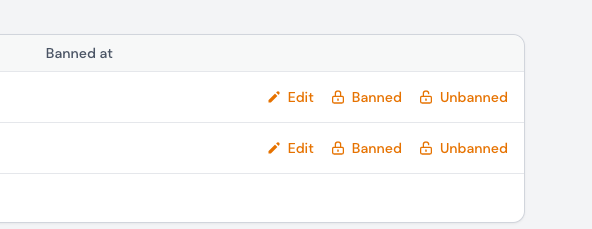
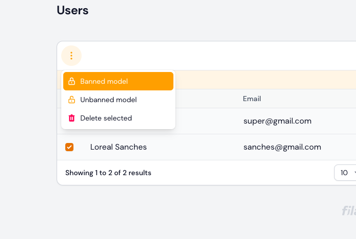

# Laravel Filament Bandel

This code forked from - [Truong Thanh Tung Filament Ban](https://github.com/ttungbmt/filament-ban.git)

## Introduction

We are using [laravel-ban by cybercog](https://github.com/cybercog/laravel-ban) on the background.




## Requirement
- Laravel 10
- FilamentPHP

## Installation

You can install the package via composer:

```bash
composer require widiu7omo/filament-bandel
```

You can publish and run the migrations with:

```bash
php artisan vendor:publish --tag="filament-bandel-migrations"
php artisan migrate
```

ou can publish and run the translations with:

```bash
php artisan vendor:publish --tag="filament-bandel-translations"

```

You can publish the config file from cybercog/laravel-ban with:

```bash

php artisan vendor:publish --tag="ban-config"
```

### Prepare Bannable model

```php
use Cog\Contracts\Ban\Bannable as BannableContract;
use Cog\Laravel\Ban\Traits\Bannable;
use Illuminate\Foundation\Auth\User as Authenticatable;

class User extends Authenticatable implements BannableContract
{
    use Bannable;
}
```

### Prepare bannable model database table

Bannable model must have `nullable timestamp` column named `banned_at`. This value used as flag and simplify checks if
user was banned. If you are trying to make default Laravel User model to be bannable you can use example below.

### Register Ban Actions in Filament Resource

Register `BanAction` and `UnbanAction` actions inside your Model's Resource.

```php
    public static function table(Table $table): Table
    {
        return $table
            ->actions([
//                ...rest,
                \Widiu7omo\FilamentBandel\Actions\BanAction::make(),
                \Widiu7omo\FilamentBandel\Actions\UnbanAction::make()
            ]);
    }
```

### Register Bulk Un/Ban Actions in Filament Resource

Register `BanBulkAction` and `UnbanBulkAction` actions inside your Model's Resource.

```php
    public static function table(Table $table): Table
    {
        return $table
            ->prependBulkActions([
//            ...rest
                \Widiu7omo\FilamentBandel\Actions\BanBulkAction::make('banned_model'),
                \Widiu7omo\FilamentBandel\Actions\UnbanBulkAction::make('unbanned_model'),
            ]);
    }
```

## Changelog

Please see [CHANGELOG](CHANGELOG.md) for more information on what has changed recently.

## Contributing

Please see [CONTRIBUTING](https://github.com/spatie/.github/blob/main/CONTRIBUTING.md) for details.

## Security Vulnerabilities

Please review [our security policy](../../security/policy) on how to report security vulnerabilities.

## Credits

- [Danar Widi](https://github.com/widiu7omo)
- [Truong Thanh Tung](https://github.com/ttungbmt)
- [All Contributors](../../contributors)

## License

The MIT License (MIT). Please see [License File](LICENSE.md) for more information.
